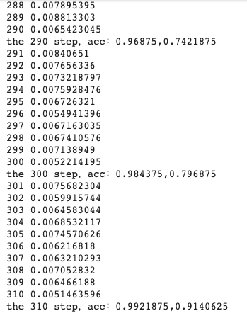
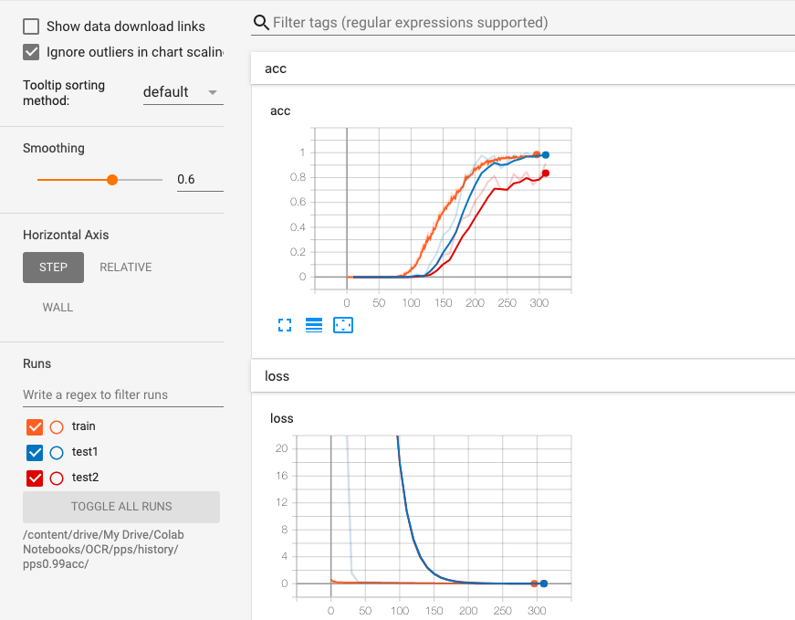

# Captcha_cracker

A demonstration on cracking Captcha using CNN.

## Getting Started

Download the folder "Download", upload it into the Jupyter notebook environment.
Simply run the notebook with any Jupyter notebook environment.
Make sure the file paths and toggle key are correct.

    SUMMARY_DIR_ = /YOUR/SUMMARY/DIRECTORY/   #Directory that the model summary stored while training.
    MODEL_DIR_ =  SUMMARY_DIR_   #Directory that the model graph stored after training.
    MODEL_PATH_ = /YOUR/MODEL/FILE/   #File of the model graph.
    IMAGE_DIR_ = /YOUR/IMAGES/DIRECTORY/   #Directory of the raw captcha images.
    FONT_DIR_ = /YOUR/WOND/FONT/FILE/DIRECTORY/   #Directory of the word font files.
    MODEL_NAME_ = FILENAME_OF_MODEL   #Filename of th model graph. 
    TOGGLE_KEY = 1   #0 for training , 1 for predicting , 2 for data exploration (captcha generator)

    %tensorboard --logdir /YOUR/SUMMARY/DIRECTORY/

Lastly, run the whole notebook, and see the result in Operation section/ Tensorboard section.

### Training

The model will continue training until 85% accuracy of the dev set is reached.
The loss value is reported for each epoch and test was done for every 10 epoch; Loss and accuracy against epoch is ploted using Tensorboard.

### Predicting

Choose the image to predict and change the parameter batch_x_predict. If labels are provided, accuracy will be reported as well.

### Data Exploration

Before training the CNN model, captcha generator's parameters are fine tuned during data exploration. Under this mode, a generated image and a random picked raw image are shown side by side for comparison. Besides, a section of the image matrix, and some statistical information are also provided.

## Reference

* [ImageCaptcha](https://github.com/lepture/captcha) - Used to generate Captcha

## License

This project is licensed under the MIT License - see the [LICENSE.md](LICENSE.md) file for details
